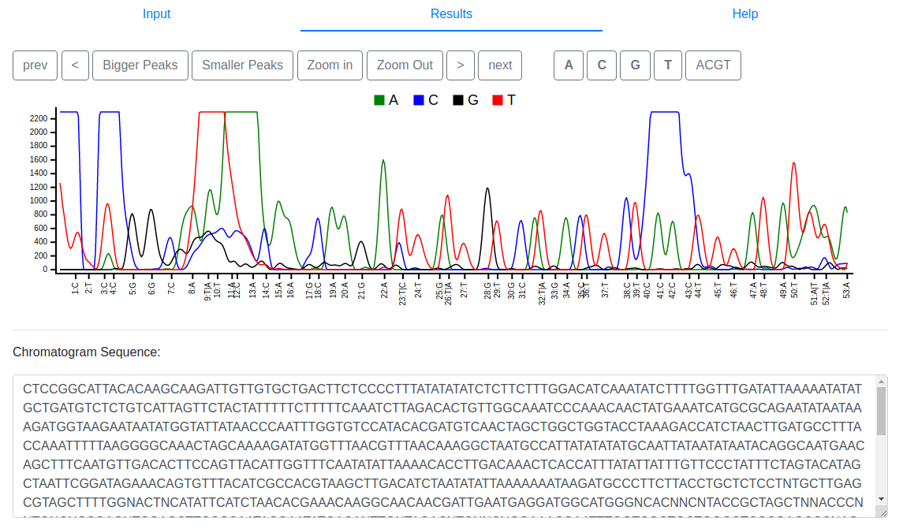
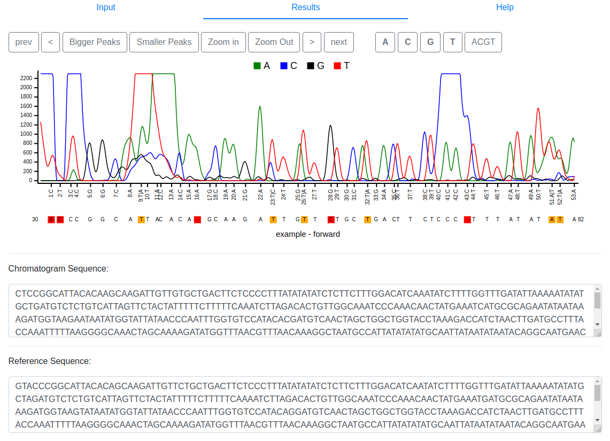
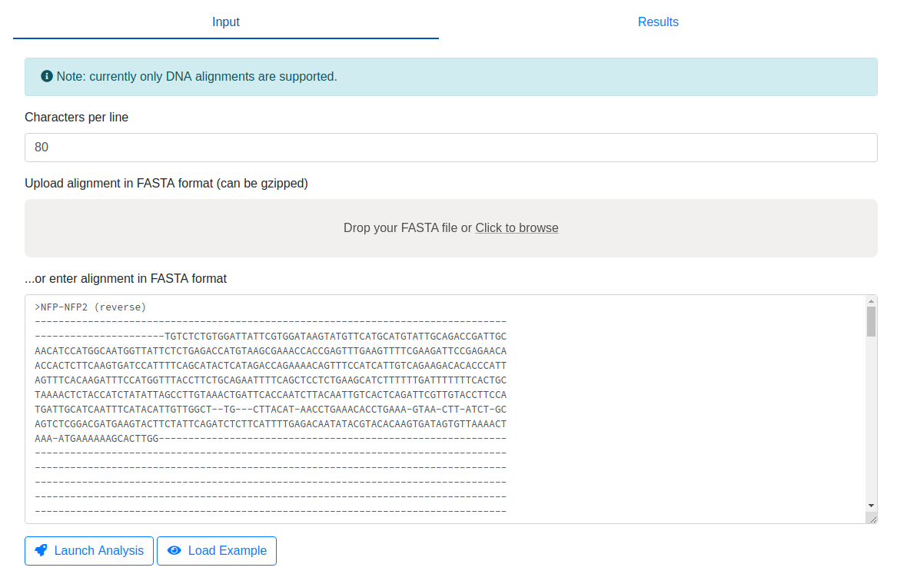
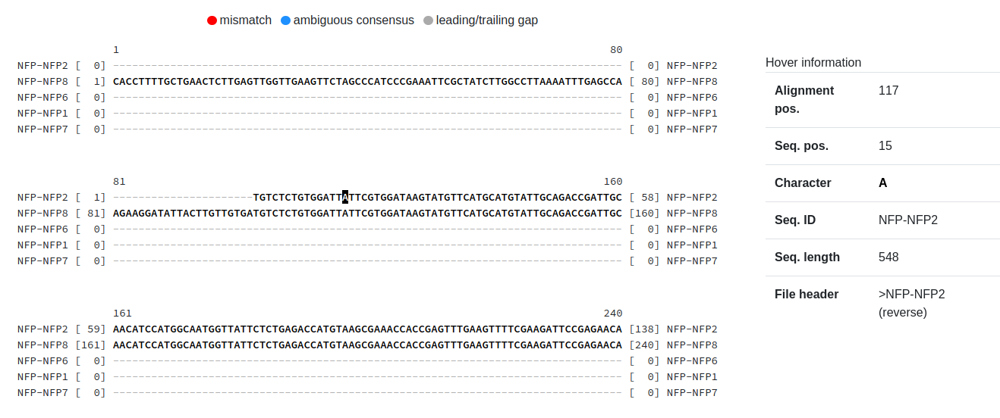
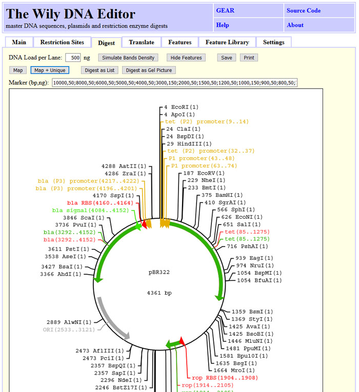

# Web Applications

Tracy features a range of companion web applications hosted at [https://www.gear-genomics.com](https://www.gear-genomics.com) for browsing trace alignments, inspecting variant calls or patching reference sequences. The web apps consist of [teal](#teal) (trace browser), [sage](#sage) (trace alignment), [indigo](#indigo) (trace decomposition and variant calling), [pearl](#pearl) (patching a reference sequence using trace information), [sabre](#sabre) (multiple trace alignment viewer) and the [Wily-DNA-Editor](#wily-dna-editor) (sequence editor).

## Teal

[Teal](https://www.gear-genomics.com/teal/) is a simple viewer for Sanger chromatogram traces.
The input tab of Teal requires a chromatogram trace file in scf, abi, ab1 or ab format.
The `Launch Analysis` button kicks off tracy and the results are
visualized in a separate browser tab. At the top, Teal shows the trace
signal. The navigation buttons on the top left side can be used to move
the actual view and zoom in or out. The buttons on the top right side
highlight a base of choice. The chromatogram sequence is provided below
the trace signal.

## Sage

[Sage](https://www.gear-genomics.com/sage/)
aligns a Sanger chromatogram trace to a reference sequence. The
input tab of Sage requires a chromatogram trace file in scf, abi, ab1 or
ab format. Optionally, a left and right trimming size for this trace can
be specified. We recommend using Teal for estimating such trim sizes.
Sage also requires a reference sequence as input. This can be either a
wildtype chromatogram, a small sequence in FASTA format or a large
indexed reference genome.

Once these input requirements have been
specified the `Launch Analysis` button kicks off tracy and the results are
visualized in a separate browser tab. At the top, Sage shows the gapped
trace signal with the gapped reference aligned below. Mismatches between
reference and trace are colored red to highlight them for easy
identification. Traces with secondary peaks are colored orange. The
navigation buttons on the top left side can be used to move the actual
view and zoom in or out. The buttons on the top right side highlight a
base of choice. The chromatogram sequence and the reference sequence are
provided below the trace signal.

## Indigo

[Indigo](https://www.gear-genomics.com/indigo) can be used to identify single-nucleotide variants (SNVs) and short insertions or deletions (InDels) in a Sanger Chromatogram trace. The application also supports deconvolution of heterozygous mutations: SNVs cause simple double peaks but heterozygous InDels cause a shift in the trace signal and Indigo can be used to separate the two overlapping alleles. The input screen of Indigo requires a chromatogram trace file in scf, abi, ab1 or ab format. Optionally, a left and right trimming size for this trace can be specified. We recommend using [teal](https://www.gear-genomics.com/teal) for estimating such trim sizes. Indigo also requires a reference sequence as input to identify variants. This can be either a wildtype chromatogram, a small sequence in FASTA format or a large indexed reference genome. Once these input requirements have been specified the launch analysis button kicks off tracy and the results are visualized in a separate browser tab. At the top, Indigo shows the actual trace signal. Below the trace viewer is an alignment of both deconvoluted alleles with respect to the reference and an alignment of both alleles against each other. Following the alignment, Indigo lists all identified variants including their rs identifier if it is a known polymorphism, a calling quality, estimated genotype and the basecalling position in the original trace. Please note that all variants are connected via hyperlinks to the original trace for easier browsing. At the very bottom, Indigo shows the decomposition plot. In case of heterozygous InDels you should observe two distinct minima in this plot. For instance, the provided example trace file contains a heterozygous 7bp deletion and thus, Indigo shows a minima for 0 and -7bp in the decomposition plot. All plots of Indigo can be saved in png format, zoomed and panned using the [plotly](http://help.plot.ly) buttons at the top of each chart.

## Pearl

[Pearl](https://www.gear-genomics.com/pearl/)
is a tool to patch a DNA references with several Sanger trace
files. It has two main applications: (Parts) of a reference sequence
(fasta file, \*.fa) can be sequenced and Pearl highlights the conflicts
and mismatches between reference and the trace files. If no reference is
provided, a consensus sequence is assembled and used instead.

The input
tab of Perl requires several chromatogram trace files in scf, abi, ab1
or ab format. Pearl may use an optional reference sequence in FASTA
format as input. The user may choose if secondary peaks should be
treated as conflicts. Once these input requirements have been specified
the `Launch Analysis` button kicks off tracy and the results are
visualized in a separate browser tab.

In the results tab Pearl shows the color-coded consensus overview
sequence on top:

- light green - consensus: all traces agree on same base
- red - mismatch: traces agree on different base then reference
- orange - conflict: conflict, some traces suggest other bases
- green - edited: the base was entered manually by the user
- grey - no information: only reference data available

By design, Pearl focuses only on one location, the position given below
the overview. A position can be selected by clicking at a position in
the overview sequence, by changing the number in the position field or
by navigating the trace windows.

The available traces at the given position can be reviewed by the user
and manually set with the `Set...` buttons to a certain base. The `Jump to next conflict` button moves the position to the next conflict. Below the
traces three sequences are given

1. the user sequence including all manually edited bases
2. the reference as uploaded
3. the consensus calculated by Pearl

Once all mismatches and conflicts are edited by the
user, the sequence can be exported as FASTA. The entire dataset
including the traces can be saved as a JSON file and uploaded in the
result section later using the buttons at the top of the result tab.

## Sabre

[Sabre](https://www.gear-genomics.com/sabre/) is a multiple sequence alignment
viewer which allows you to view all trace sequences in parallel. An alignment in
FASTA format has to provided via file upload or pasting into the provded text area.
The default number of characters per alignment row is set to 80 by default,
but this can be adjusted.
Once everything is ready, press the `Launch Analysis` button.
Note that as with all GEAR apps, we provide an example to view. For this, first
press `Load Example` and then `Launch Analysis`.

You will now get redirected to the output page where you can browse the multiple
sequence alignment of all traces. If you hover over individual bases, information
about this particular position (both in the context of the corresponding sequence
as well as the alignment) is shown on the right.

## Wily-DNA-Editor

The Wily-DNA-Editor is a tool for plasmid assembly, reverse complementing
DNA, translating to protein code and calculating restriction digests maps.

The screenshot below illustrates the basic DNA/RNA operations that Wily can
perform, such as reverse-complementing DNA, removing non-IUPAC letters and
changing upper to lower case and vice versa.

Furthermore, you can find restriction sites, select them and highlight them
in the sequence.

You can draw restriction maps with or without features for linear
and circular sequences.

You can simulate gel band intensity or draw all bands black.

Translate DNA in one, three or six frames.

Last but not least, Wily let's you annotate regions in the DNA
using GenBank features.

